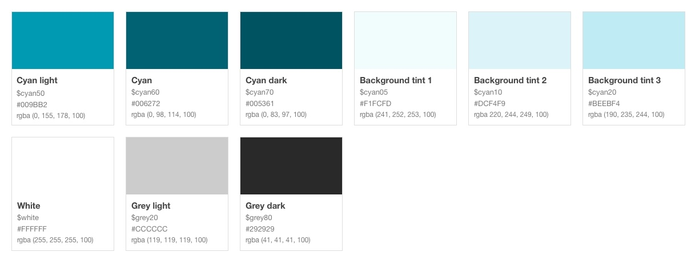
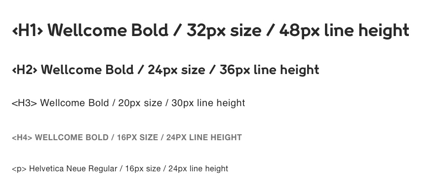
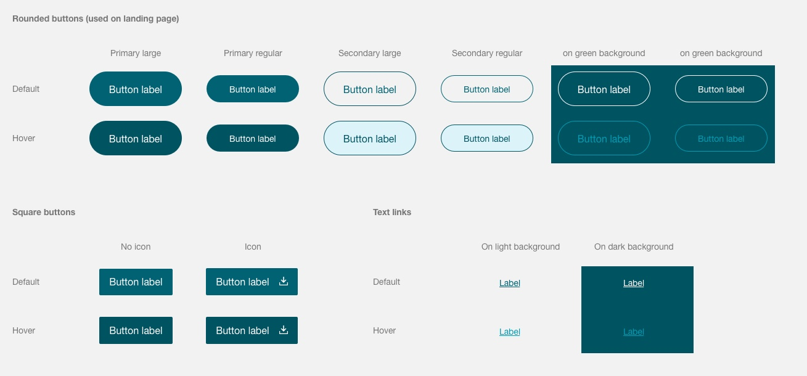
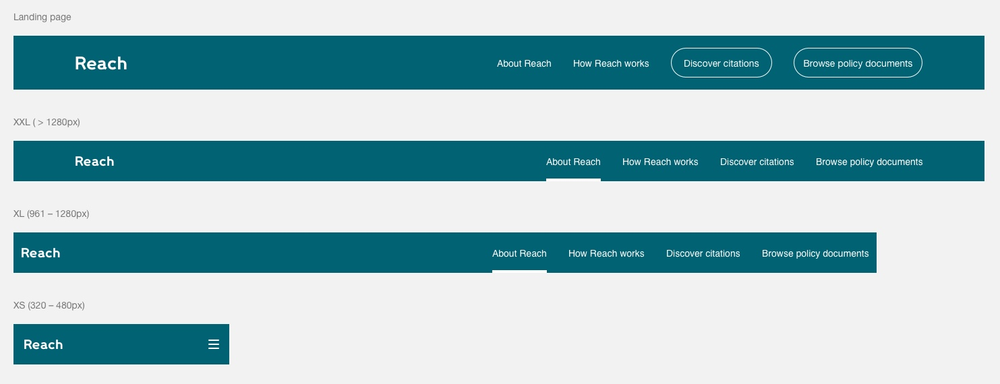
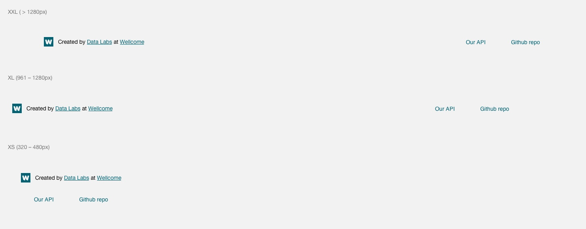
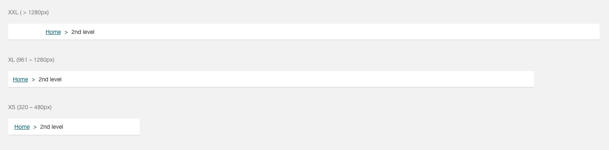
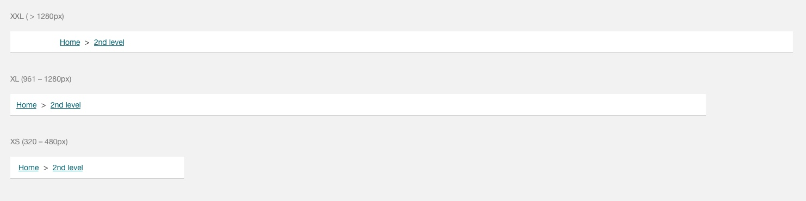
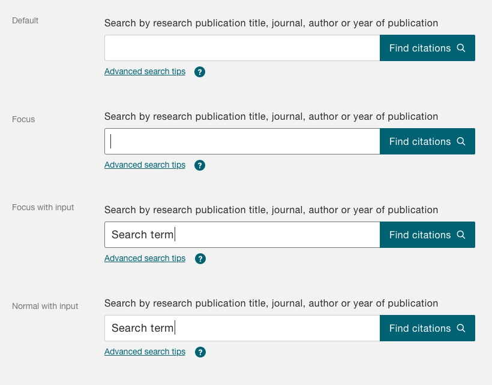
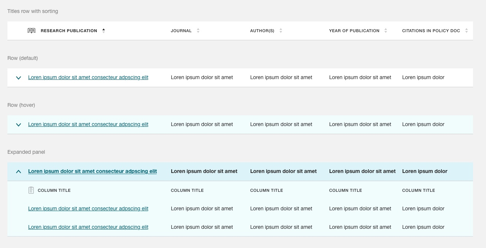

# Reach – Design System
Created by Data Labs at Wellcome Trust

# 1.1. Intro
----------

The present document provides a high level overview of the Reach brand and style. [Spectre.CSS](https://picturepan2.github.io/spectre/index.html) is used as the CSS framework, but the UI components should be adapted to provide a unique user experience to the website.

# 1.2. Colour Palette
----------

The web colour palette is taken largely from the Wellcome brand book ([Data Viz section](https://company-57536.frontify.com/d/gFEfjydViLRJ/wellcome-brand-book#/visuals/dataviz-elements-and-rationale)) with certain additions to accommodate the web environment.

# 1.3. Typography
----------

Wellcome's brand fonts (Wellcome & Helvetica Neue) are used alternatively throughout the website with no exceptions. 

# 1.4. Grid System
----------

The grid system follows [Spectre CSS framework](https://picturepan2.github.io/spectre/layout/responsive.html).

| XS  | 320 – 480px  | padding left/right 11px                                |
| --- | ------------ | ------------------------------------------------------ |
| SM  | 481 – 600px  | TBC                                                    |
| MD  | 601 – 840px  | TBC                                                    |
| LG  | 961 – 1280px | TBC                                                    |
| XL  | 961 – 1280px | 12 columns  :  gutter 22px  :  padding left/right 11px |
| XXL | > 1280px     | 12 columns  :  gutter 22px                             |

# 1.5. UI Components

## 1.5.1. Buttons
----------

## 1.5.2. Header
----------

## 1.5.3. Footer
----------

## 1.5.6. Breadcrumbs > 2 levels
----------

In the breadcrumb trail, the breadcrumb corresponding to the current page **should not be a link**.

## 1.5.7. Breadcrumbs > 3 levels (Search results pages)
----------

The **search term is excluded from breadcrumbs** (to avoid long pages on mobile)

## 1.5.8. Search
----------

## 1.5.9. Tables
----------

